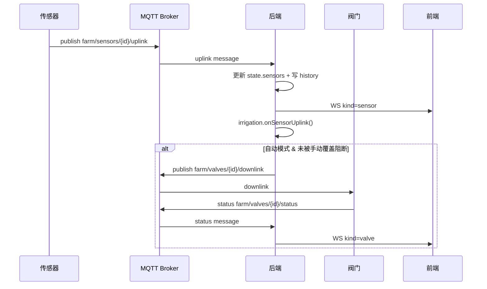
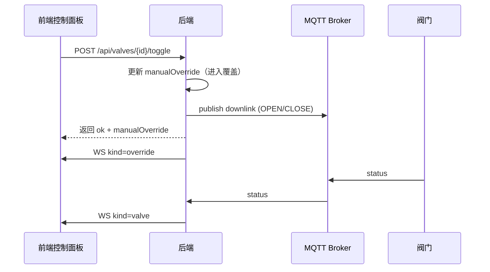

# 智慧农业精准灌溉系统（final_convert）

本目录是融合实现版本：以 `smart-agriculture` 为基座，合并了 `code` 项目中的“按传感器/阀门绑定的灌溉策略（IrrigationPolicy）”能力，并新增了**手动覆盖（ON/OFF 一键开关）**与**地图灌溉状态可视化**。

核心目标：在单机或局域网部署一个完整的“监测 → 决策 → 控制”闭环系统，具备实时可视化、历史查询、自动灌溉、手动干预与策略配置能力。

## 项目技术栈与框架说明

### 后端（Node.js）
- Node.js（ESM）
- Express（REST API）
- ws（WebSocket 实时推送）
- mqtt（客户端，订阅 uplink/status，发布 downlink）
- aedes（内置 MQTT Broker，可选启用）
- 本地文件存储（JSON/JSONL：设备元数据/策略/历史）

### 前端（Vue3）
- Vue 3 + Vite
- ECharts（仪表盘/趋势/地图）
- Fetch API（HTTP）
- WebSocket（实时推送）

### 数据模拟（可选）
- Python 模拟器：传感器 uplink、阀门响应 status、电池模型等

### 桌面端打包（可选）
- Electron + electron-builder：将前端打包为 Windows `.exe`，并在桌面端自动拉起后端（不修改任何源代码文件）

## 核心模块与架构设计

### 目录结构
- `backend/` 后端（HTTP + WebSocket + MQTT Broker/Client + 自动灌溉）
- `frontend/` 前端（仪表盘/趋势/地图/控制面板/历史查询）
- `simulator/` Python 终端/阀门模拟器（可选）
- `desktop/` Electron 打包工程（可选）
- `INTEGRATION.md` 融合集成点说明（策略/手动覆盖/API 等）

### 架构总览

```mermaid
flowchart LR
  subgraph Simulator[模拟器（Python，可选）]
    S[传感器(50)] -->|MQTT uplink| B
    V[阀门(10)] -->|MQTT status| B
    B -->|MQTT downlink| V
  end

  subgraph Backend[后端（Node.js）]
    MB[(MQTT Broker<br/>aedes 可选)] --- BE
    BE[数据处理 + 状态管理 + 灌溉决策] -->|WS 推送| FE
    FE -->|HTTP API| BE
    FS[(本地文件 data/<br/>devices/strategy/history)] --- BE
  end

  subgraph Frontend[前端（Vue3）]
    FE[页面/组件（Dashboard/Trend/Map/Control/History）]
  end
```

## 核心模块功能与交互关系

### 后端模块（`backend/src`）
- `index.js`：入口；启动 MQTT Broker（如端口未被占用）、启动 HTTP/WS；订阅 uplink/status；写入 history；触发自动灌溉。
- `state.js`：内存态（`sensors/valves Map`、`strategy`、`policies`、`manualOverride`、`pendingCommands` 等）。
- `irrigation.js`：灌溉核心（自动阈值/自动策略 + 手动覆盖 + MQTT 下发）。
- `routes.js`：REST API（devices/strategy/latest/history + policies/override/toggle）。
- `ws.js`：WebSocket 推送（hello + sensor/valve/override 等事件）。
- `storage.js`：JSON/JSONL 读写（原子写入/追加/区间读取）。

### 前端模块（`frontend/src`）
- `App.vue`：顶层状态管理与 WS 接入；集中错误提示；与后端 API 交互。
- `pages/MapPage.vue`：地图与状态可视化（阀门 OPEN/CLOSE + 手动覆盖标识）。
- `pages/ControlPage.vue` + `components/IrrigationControl.vue`：自动方式切换（阈值/策略）、策略编辑保存、手动一键开关与释放手动。
- `api.js`：HTTP 封装（含 policies/override/toggle）。
- `wsClient.js`：WebSocket 断线重连。

## 数据流与控制流示意图

### 传感器上报 → 自动决策 → 阀门执行 → 前端可视化


### 手动一键开关（进入手动覆盖）


## 关键算法与业务逻辑解析

### 自动灌溉：阈值模式（`strategy.autoMethod=threshold`）
- 传感器上报湿度 `humidityPct`
- 根据设备元数据映射：`sensorId -> zone -> valveId`
- 决策：
  - 若 `humidity <= humidityLowPct` 且阀门未打开，且满足 cooldown，则 OPEN(`openDurationSec`)
  - 若 `humidity >= humidityHighPct` 且阀门已打开，则 CLOSE
- 若阀门处于手动覆盖，则自动动作被阻断（避免自动与手动互相“打架”）

### 自动灌溉：策略模式（`strategy.autoMethod=policy`）
迁移自原 `code` 项目的 IrrigationPolicy 思路：`humidity < threshold => OPEN(duration)`
- 遍历启用的 policies：匹配 `sensorId`
- 若 `humidity < humidityThreshold`，则对 `valveId` 下发 OPEN(`durationSeconds`)
- 同样遵循手动覆盖阻断

### 手动覆盖（Manual Override）
- 控制面板“开启/关闭”按钮会：
  - 将全局覆盖 `manualOverride.enabled` 置为 true
  - 将该阀门 `manualOverride.valves[valveId].enabled` 置为 true
  - 下发阀门 OPEN/CLOSE，并在地图上标识为橙色菱形
- “释放手动”会将该阀门覆盖置为 false，从而恢复自动可控

## 环境配置指南

### 开发环境要求
- Windows 10/11
- Node.js 20+（建议 20 LTS）
- npm 9+
- Python 3.10+（仅在需要运行 simulator 时）

### 依赖安装步骤
```bash
cd backend && npm ci
cd ..\\frontend && npm ci
```

### 构建和运行命令

#### 一键启动（Windows）
```bash
.\start_system.bat
```

#### 手动启动
1) 后端（默认 HTTP=3000，MQTT=1883）
```bash
cd backend
npm run dev
```

2) 前端（Vite=5173）
```bash
cd ..\\frontend
npm run dev
```

3) （可选）模拟器
```bash
cd ..\\simulator
python -m venv .venv
.\.venv\Scripts\pip install -r requirements.txt
.\.venv\Scripts\python run_simulators.py --mqtt-host 127.0.0.1 --mqtt-port 1883
```

### 调试和测试方法
- 健康检查：`GET /api/health`
- 后端冒烟：`cd backend && npm run smoke`
- history 验证：`cd backend && npm run validate`
- 前端构建：`cd frontend && npm run build`

## 使用示例

### 切换自动方式（threshold/policy）
```bash
curl -X PUT http://127.0.0.1:3000/api/strategy ^
  -H "Content-Type: application/json" ^
  -d "{\"autoMethod\":\"policy\"}"
```

### 更新策略式灌溉 policies
```bash
curl -X PUT http://127.0.0.1:3000/api/policies ^
  -H "Content-Type: application/json" ^
  -d "{\"policies\":[{\"id\":\"p1\",\"sensorId\":\"S001\",\"valveId\":\"V001\",\"humidityThreshold\":35,\"durationSeconds\":600,\"active\":true}]}"
```

### 手动一键开关
```bash
curl -X POST http://127.0.0.1:3000/api/valves/V001/toggle ^
  -H "Content-Type: application/json" ^
  -d "{\"durationSec\":120}"
```

### 释放手动（恢复自动可控）
```bash
curl -X POST http://127.0.0.1:3000/api/override ^
  -H "Content-Type: application/json" ^
  -d "{\"valveId\":\"V001\",\"enabled\":false,\"desiredState\":null}"
```

## Windows 前端打包（Electron）

Electron 打包工程位于 `desktop/`，打包过程不会修改任何源代码文件（仅构建与打包）。请阅读：
- `desktop/README.md`

最简步骤（在 `desktop/` 下）：
```bash
npm ci
npm run dist:win
```

## 常见问题解答（FAQ）

### 1) 端口占用（3000/1883 或 Electron 的 3001/1884）
- 开发模式默认使用 3000/1883；Electron 桌面端使用 3001/1884。
- 若端口被占用：
  - 关闭占用程序，或
  - 启动后端时通过环境变量改端口，并同时为前端设置 `VITE_API_BASE/VITE_WS_URL`。

### 2) 页面没有实时数据
- 确认后端在线：访问 `/api/health`
- 确认模拟器或真实设备在发 MQTT uplink
- 确认前端 WebSocket 连接状态为“在线”

### 3) 手动开关无效
- 若后端返回 `MQTT not connected`，说明后端未连接到 MQTT Broker（检查 MQTT 端口/进程）
- 查看 `/api/override` 是否已启用手动覆盖，以及阀门是否处于覆盖状态
